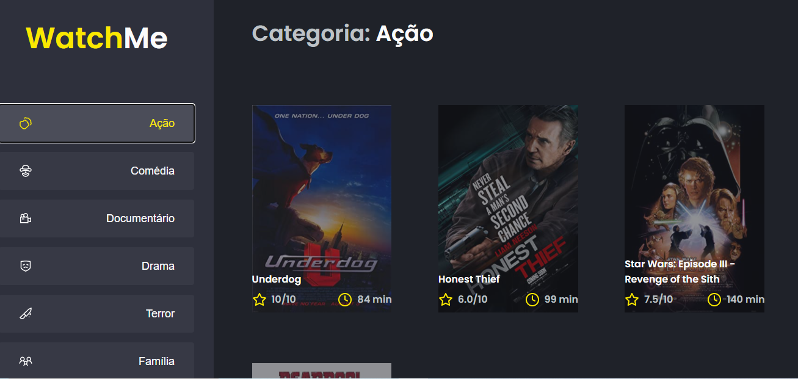

# Watch Me

> Creating Front End APP to select movies at categories.  

### 🧪 Technologies

- React 
- TypeScript

 using JSON Server to simulate a API that contend information the movies and genres.
> add yarn server to loader API.

